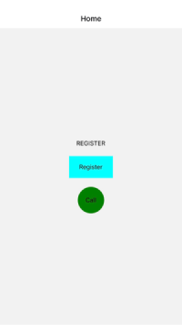
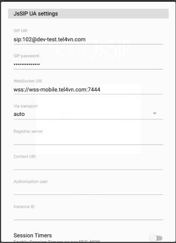

##### react-native-pitel-voip

# Integrate Voip call to your project

[](https://documents.tel4vn.com/)

`react-native-pitel-voip` is package support for voip call.

## Demo




## Features

- Register Extension
- Call
- Hangup
- Turn on/off micro
- Turn on/of speaker

## Installation

1. Install Packages
   Add pubspec.yaml:

```pubspec.yaml
yarn add react-native-pitel-voip
```

2. Installing dependencies into a bare React Native project

```pubspec.yaml
yarn add pitel-react-native-webrtc pitel-sdk-webrtc react-native-svg
```

3. Pod install

```pubspec.yaml
cd ios
pod install
```

4. Installing react-native-svg-transformer
   Follow document & setup [react-native-svg-transformer](https://github.com/kristerkari/react-native-svg-transformer)

```
yarn add --dev react-native-svg-transformer
```

5. Configure Project

#### Android:

- In file `android/app/src/main/AndroidManifest.xml`

```xml
 <manifest...>
    ...
    // Request permission
    <uses-permission android:name="android.permission.INTERNET" />
    <uses-permission android:name="android.permission.ACCESS_NETWORK_STATE" />
    <uses-permission android:name="android.permission.CAMERA" />
    <uses-permission android:name="android.permission.RECORD_AUDIO" />
    <uses-permission android:name="android.permission.WAKE_LOCK" />
    <uses-permission android:name="android.permission.BLUETOOTH" />
    <uses-permission android:name="android.permission.MODIFY_AUDIO_SETTINGS" />
 </manifest>
```

#### IOS

- Request permission in file `Info.plist`

```
<key>NSMicrophoneUsageDescription</key>
<string>Need microphone access for voip call</string>
<array>
	<string>fetch</string>
	<string>processing</string>
	<string>remote-notification</string>
	<string>voip</string>
</array>
```

- Make sure platform ios `12.0` in `Podfile`

```
platform :ios, '12.0'
```

## Example

Please checkout repo github to get [example](https://github.com/anhquangmobile/rn-pitel-demo)

## Usage

- In file `home_screen.js`
  Please follow [example](https://github.com/anhquangmobile/rn-pitel-demo/tree/main/libs/screens/home_screen)

> Note: handleRegisterCall, handleRegister in [here](https://github.com/tel4vn/pitel-ui-kit/blob/feature/v1.0.2/lib/features/home/home_screen.dart)
> Config sdkOption

```js
const sdkOptions = {
  sipOnly: true,
  sipDomain: `${domain}`,
  wsServer: `${wssServer}`,
  sipPassword: `${extensionPassword}`,
  debug: true,
};
```

- Init state.

```js
import { PitelCallOut, useRegister } from 'react-native-pitel-voip';

// useState & useRegister
const [pitelSDK, setPitelSDK] = useState();

const {
  callState,
  receivedPhoneNumber,
  registerState,

  setCallState,
  registerFunc,
} = useRegister({
  sdkOptions: sdkOptions,
  setPitelSDK: setPitelSDK,
});
```

- Register extension

```js
const registerExtension = () => {
  if (registerState === 'UNREGISTER') {
    registerFunc();
  }
  if (registerState === 'REGISTER') {
    pitelSDK.unregister('103');
  }
};
```

- Render home_screen.js

```js
<PitelCallOut
  child={<Text>Call</Text>}
  callToNumber={phoneNumber}
  sdkOptions={sdkOptions}
  pitelSDK={pitelSDK}
  setCallState={setCallState}
  callState={callState}
  style={styles.btnCall}
  onCreated={handleCreated}
  onReceived={handleReceived}
  onHangup={handleHangup}
/>
```

#### Properties

| Prop         | Description                        | Type                 | Default  |
| ------------ | ---------------------------------- | -------------------- | -------- |
| child        | child component in home screen     | component            | Required |
| callToNumber | call out phone number              | String               | Required |
| sdkOptions   | config register extension          | Object               | Required |
| callState    | status of voip call                | String               | Required |
| style        | style of call button               | StyleProp<ViewStyle> | Required |
| onCreated    | handle when create outgoing call   | () => void           | Required |
| onReceived   | handle when received incoming call | () => void           | Required |
| onHangup     | handle when hangup                 | () => void           | Required |

- In file `call_screen.js`
  [Example](https://github.com/anhquangmobile/rn-pitel-demo/blob/main/libs/screens/call_screen/index.js)

```js
import React, { useState, useEffect } from 'react';
import { PitelCallKit } from 'react-native-pitel-voip';

export const CallScreen = ({ route, navigation }) => {
  const [mute, setMute] = useState(false);
  const [speaker, setSpeaker] = useState(false);

  const { pitelSDK, phoneNumber, direction, callState } = route.params;

  useEffect(() => {
    return () => pitelSDK.hangup();
  }, []);

  return (
    <PitelCallKit
      pitelSDK={pitelSDK}
      callState={callState}
      phoneNumber={phoneNumber}
      direction={direction}
      microState={mute}
      speakerState={speaker}
      onHangup={() => {
        pitelSDK.hangup();
      }}
      onMicro={() => {
        setMute(!mute);
      }}
      onSpeaker={() => {
        setSpeaker(!speaker);
      }}
    />
  );
};
```

#### Properties

| Prop         | Description                       | Type       | Default  |
| ------------ | --------------------------------- | ---------- | -------- |
| pitelSDK     | pitelSDK get from params of route | Object     | Required |
| callState    | status of voip call               | String     | Required |
| phoneNumber  | phoneNumber                       | String     | Required |
| direction    | Outgoing or Incoming call         | String     | Required |
| microState   | status of microphone              | bool       | Required |
| speakerState | status of loud speaker            | bool       | Required |
| onHangup     | action when hangup of voip call   | () => void | Required |
| onMicro      | set microphone on/off             | () => void | Required |
| onSpeaker    | set loud speaker on/off           | () => void | Required |

## How to test

Using tryit to test voip call connection & conversation
Link: https://tryit.jssip.net/
Setting:

1. Access to link https://tryit.jssip.net/
2. Enter extension: example 102
3. Click Setting icon
4. Enter information to input field
   
5. Save
6. Click icon -> to connect
