# Pitel Voip Push notification

> **Warning**
> IOS only working on real device, not on simulator (Callkit framework not working on simulator)

## Pitel Flow

When user make call from Pitel app, Pitel Server pushes a notification for all user login (who receives the call). When user "Accept" call, extension will re-register to receive call.


## Image callkit

<table>
  <tr>
    <td>iOS(Alert)</td>
    <td>iOS(Lockscreen)</td>
    <td>iOS(full screen)</td>
  </tr>
  <tr>
    <td>
      
    </td>
    <td>
      
    </td>
    <td>
      
    </td>
  </tr>
  <tr>	  
    <td>Android(Alert) - Audio</td>
    <td>Android(Lockscreen | Fullscreen) - Audio</td>
  </tr>
  <tr>
    <td>
      
    </td>
    <td>
      
    </td>
  </tr>
 </table>
 
# Setup & Certificate
#### IOS
If you are making VoIP application than you definitely want to update your application in the background & terminate state as well as wake your application when any VoIP call is being received.

**1. Create Apple Push Notification certificate.**

- Access [https://developer.apple.com/account/resources/identifiers/list](https://developer.apple.com/account/resources/identifiers/list)
- In [Certificates, Identifiers & Profiles](https://developer.apple.com/account/resources), click Certificates in the sidebar.
- On the top left, click the add button (+).The certificate type should be Apple Push Notification service SSL (Sandbox & Production) under Services.


**2. Choose an App ID from the pop-up menu, then click Continue.**


**3. Upload Certificate Signing Request → Continue**


Follow the instructions to [create a certificate signing request](https://developer.apple.com/help/account/create-certificates/create-a-certificate-signing-request).

- **Install certificate.**
  Download the certificate and install it into the Keychain Access app(download .cer and double click to install).
- **Export the .p12 file and config in [pitel portal](https://github.com/tel4vn-team/react-native-pitel-voip/blob/main/docs/PORTAL_GUIDE.md)**
  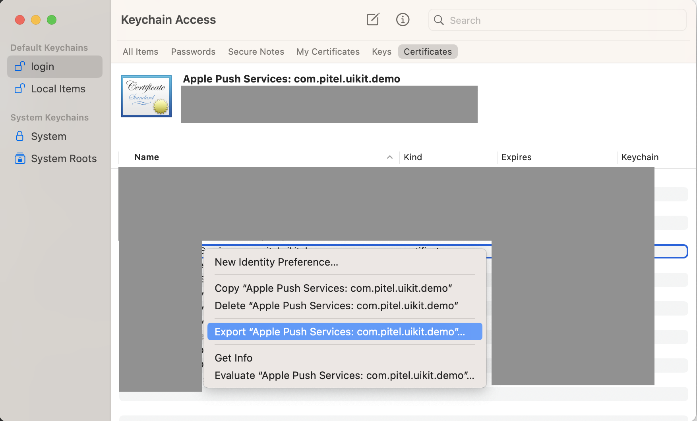

# Setup Pushkit & Callkit

#### IOS

- Open Xcode Project → Capabilities
- In Tab Signing & Capabilities. Enable Push notifications & Background Modes


- Create APNs key and upload in firebase project. In your apple developer account.
  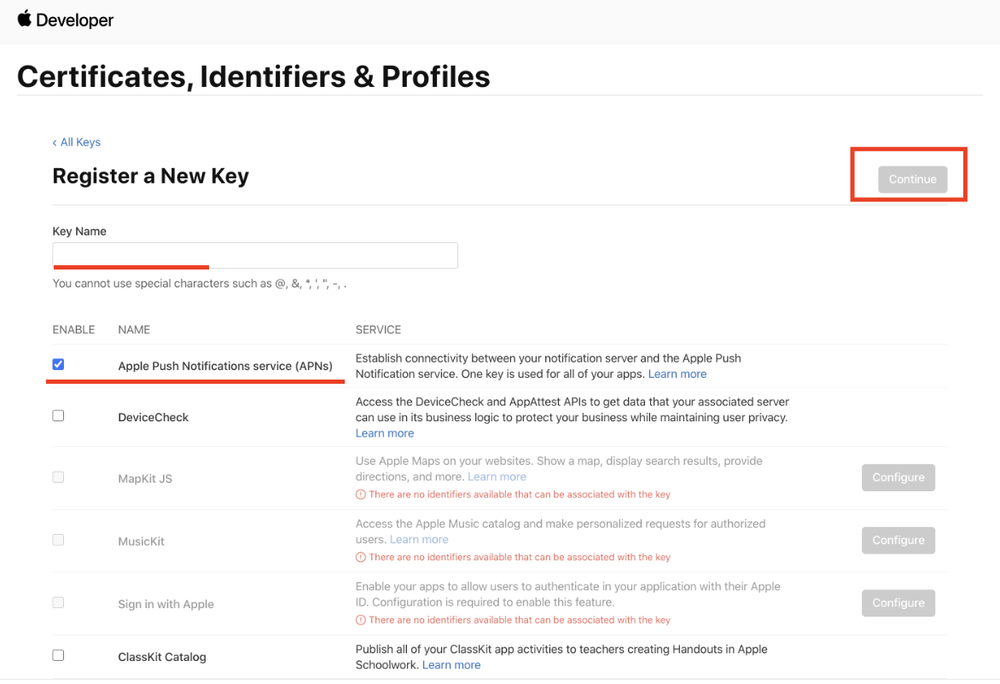
- Upload APNs key to your firebase
  - Create new your IOS App in Firebase project.
    
  - Download file .p8 to upload to firebase
    
  - Select IOS app -> upload Apns key
    
  - Fill information in upload Apns key popup
    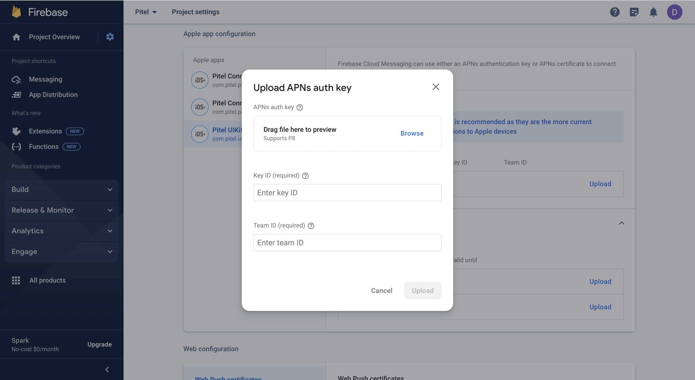

##### Installing your Firebase configuration file

- Next you must add the file to the project using Xcode (adding manually via the filesystem won't link the file to the project). Using Xcode, open the project's ios/{projectName}.xcworkspace file. Right click Runner from the left-hand side project navigation within Xcode and select "Add files", as seen below:
  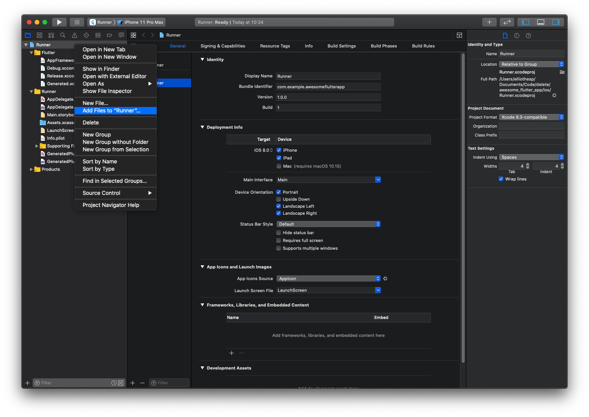
- Select the GoogleService-Info.plist file you downloaded, and ensure the "Copy items if needed" checkbox is enabled:
  

#### Android

Using FCM (Firebase Cloud Message) to handle push notification wake up app when app run on Background or Terminate

> **Warning**
> Popup request permission only working with targetSdkVersion >= 33

- Access link [https://console.firebase.google.com/u/0/project/\_/notification](https://console.firebase.google.com/u/0/project/_/notification)
- Create your packageId for android app
  
- Download & copy file google_service.json -> replace file google_service.json in path: `android/app/google_service.json`

##### Firebase Project

- Go to Project settings > Cloud Messaging and select Manage API in Google Cloud Console to open Google Cloud Console.
  
- Go to API Library using the back button as shown below.
  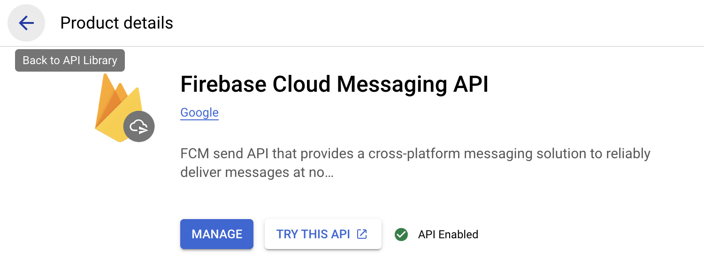
- Search "cloud messaging" -> Select "Cloud Messaging"
  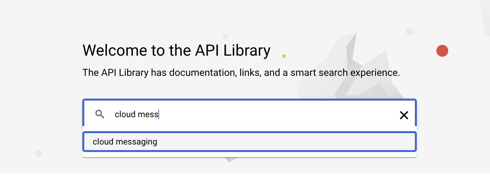
- Click Enable to start using the Cloud Messaging API.
  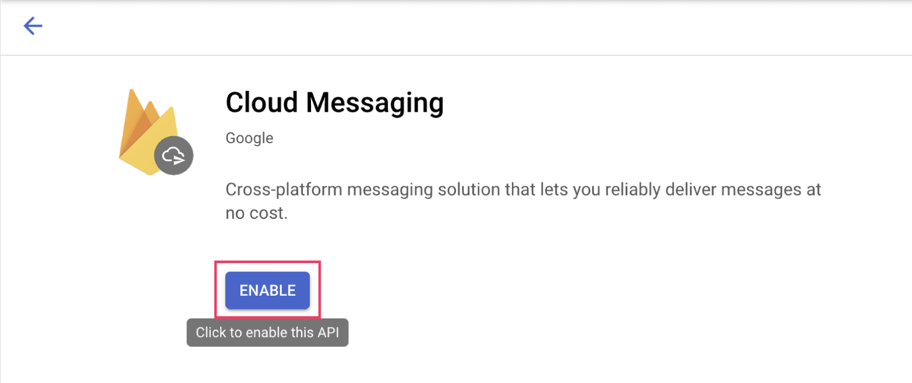

##### Service Account

- Go to Project settings > Cloud Messaging and select Manage API in Google Cloud Console to open Google Cloud Console.
  
- In tab "Credentials", scroll to "Service Accounts", click button edit with name "firebase-adminsdk".
  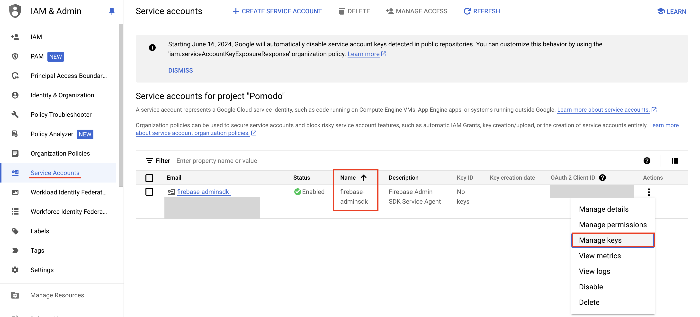
- Choose tab KEYS, click "Add key" -> "Create new key" and download json file.
  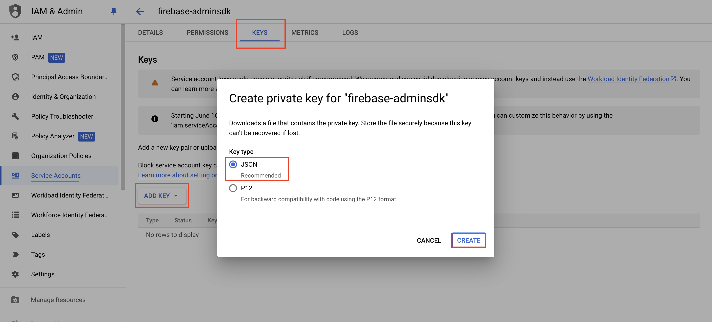

> **Note**
>
> - After complete all step Setup. Please send information to dev of Tel4vn in [here](https://portal-sdk.tel4vn.com/)
> - Please check [PORTAL_GUIDE.md](https://github.com/tel4vn-team/react-native-pitel-voip/blob/main/docs/PORTAL_GUIDE.md) to setup your config.

# Installation (your project)

- IOS: Replace your file ios/${YOUR_PROJECT_NAME}/AppDelegate.mm with
  [AppDelegate](https://github.com/tel4vn-team/rn-pitel-demo/blob/main/ios/rn_pitel_demo/AppDelegate.mm)

## How to test

- Download & install app from link https://github.com/onmyway133/PushNotifications/releases


- Fill information and click Send to Test Push Notification

Note: Add .voip after your bundleId to send voip push notification

Example:

```
Your app bundleId: com.pitel.uikit.demo
Voip push Bundle Id: com.pitel.uikit.demo.voip
```

### IOS

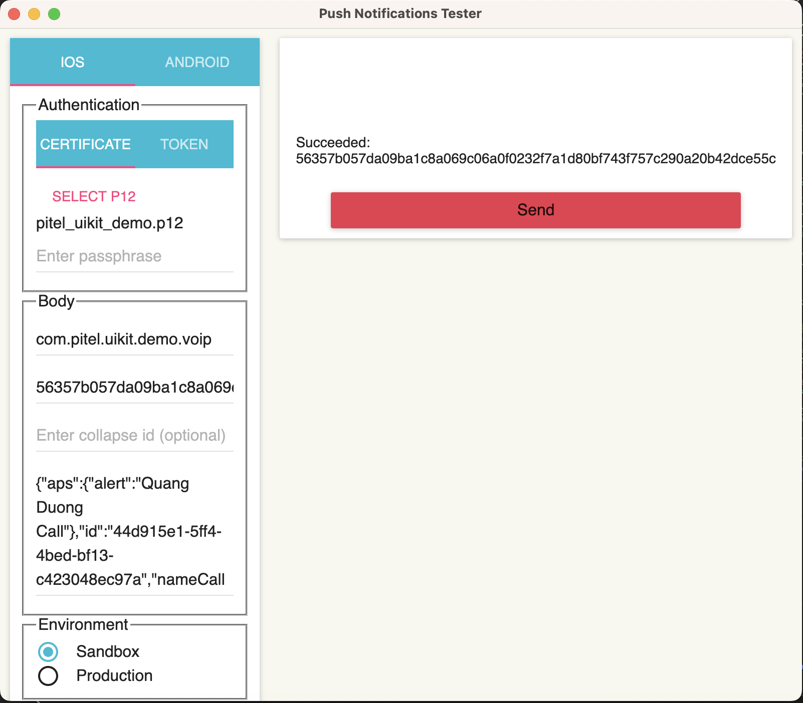

### Android: using above app or test from Postman

#### How to get access token?

- Go to https://developers.google.com/oauthplayground/
- Navigate to Step 1 (Select & authorize APIs) → Select “Firebase Cloud Messaging API v1” and click “Authorize API’s” button.
  
- You will be redirected to Authentication and needs permission for Google OAuth 2.0 Playground to view and manage the GCP services. Click “Allow” button.
- Navigate to Step 2 (Exchange authorization code for tokens) → Click “Exchange authorization code for tokens” button.
  This will generate “Refresh token” and “Access token”.
  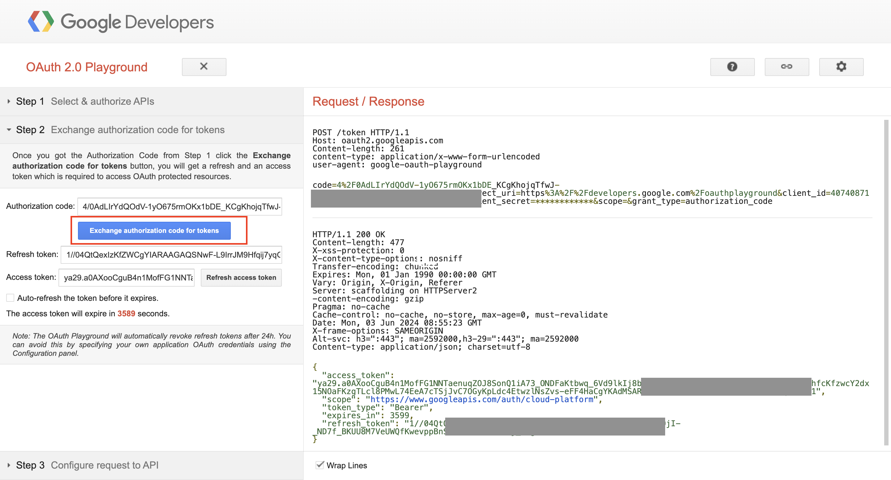

> Note:
>
> - project_id: this is your firebase project id.
> - fcm_token: replace your fcm token, get from your device.
> - access_token: get access token from oauth playground above.

cURL

```js
curl --location 'https://fcm.googleapis.com/v1/projects/${project_id}/messages:send' \
--header 'Content-Type: application/json' \
--header 'Authorization: Bearer ${access_token}' \
--data '{
    "message": {
        "notification": {
            "title": "FCM Message",
            "body": "This is an FCM Message"
        },
        "data": {
            "uuid": "77712f3-9b56-4e26-96ea-382ea1206477",
            "nameCaller": "Anh Quang",
            "avatar": "Anh Quang",
            "phoneNumber": "0375624006",
            "appName": "Pitel Connnect",
            "callType": "CALL"

        },
        "apns": {
            "headers": {
                "apns-priority": "10",

                "sound": ""
            },
            "payload": {
                "aps": {
                    "mutable-content": 1,
                    "content-available": 1
                }
            }
        },
        "android": {
            "priority": "high"
        },
        "token": "${fcm_token}"
    }
}'
```
